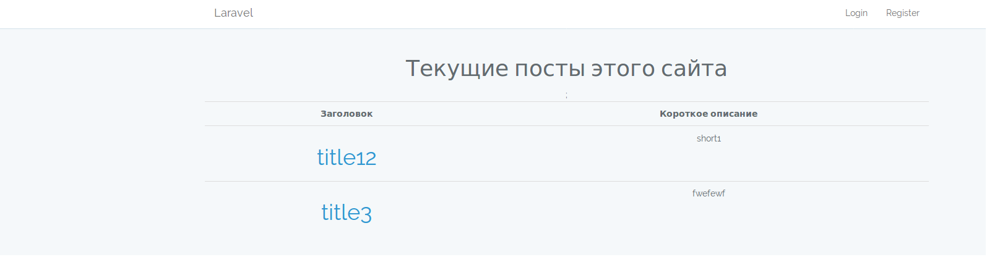
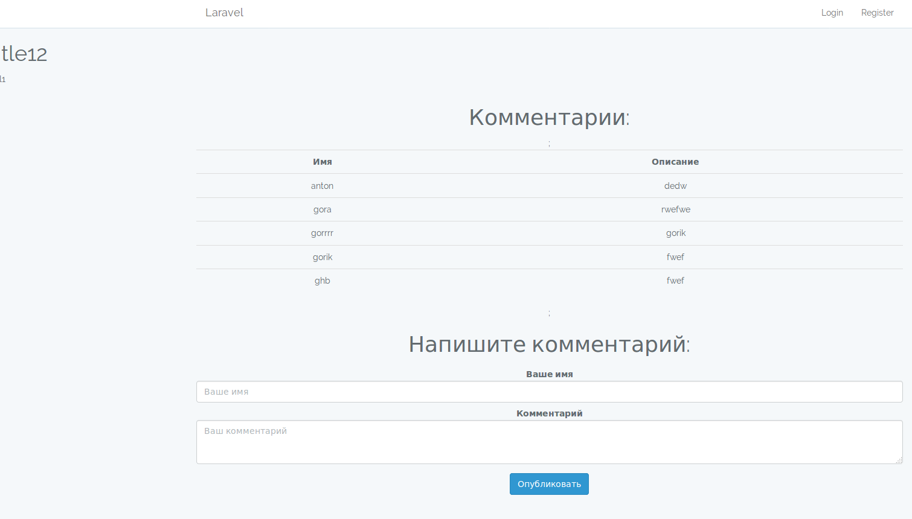
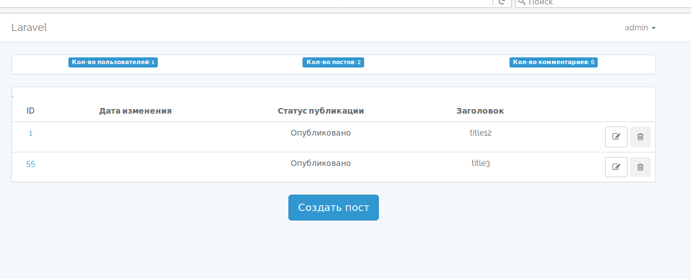
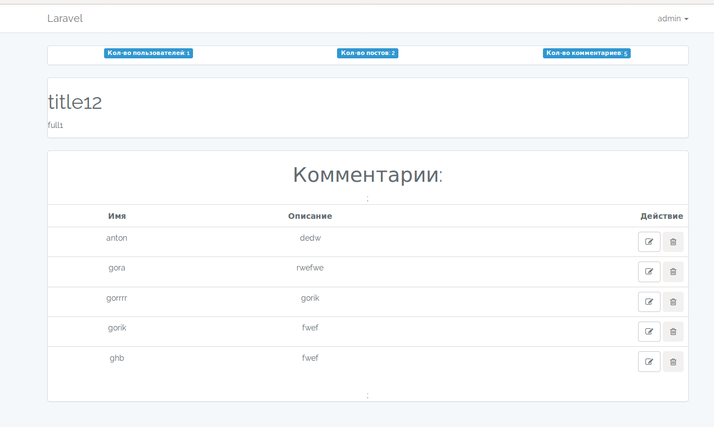

Установка(Installation): 
1) git clone https://github.com/gimtonic/blog_with_comments.git 
2) cp .env.example .env 
Настраиваем подключение к БД (Configuring the connection to the database) 
3)composer install 
4)yarn или npm install 
5)php artisan config:cache 
6)php artisan migrate  

Если у вас возникли вопросы, обязательно напишите мне.  
Мои контакты:  
Телеграмм: @gimtonic86  
Почта: gimtonic@rambler.ru 

If you have any questions, be sure to email me. 
My contacts:  
Telegrams: @ gimtonic86  
E-mail: gimtonic@rambler.ru
